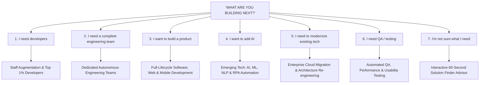
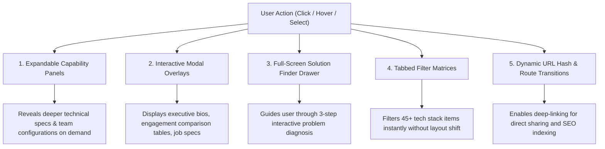
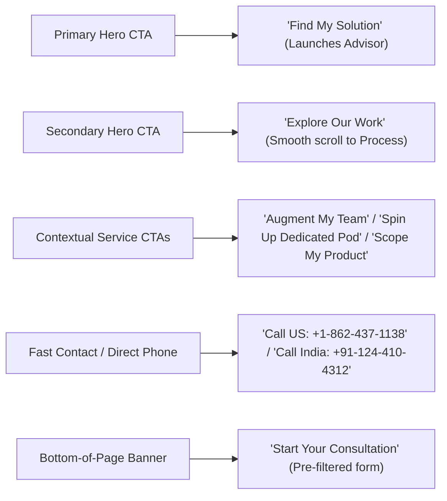

# BTM Outsourcing — New Customer Experience & Information Architecture (IA)

**Version:** 2.0 (Next-Generation Interactive Technology Advisor)  
**Creation Date:** August 2026  
**Document Status:** Approved Architecture Plan  
**Target:** Transform `btmoutsourcing.com` from a traditional outsourcing directory into an interactive, high-conversion technology advisor experience.

---

## Table of Contents
1. [Core Philosophy & Experience Principles](#1-core-philosophy--experience-principles)
2. [Primary Navigation & Global Header](#2-primary-navigation--global-header)
3. [The 7 Primary Customer Pathways](#3-the-7-primary-customer-pathways)
4. [Homepage Information Architecture](#4-homepage-information-architecture)
5. [Progressive Disclosure & Interactive UI Patterns](#5-progressive-disclosure--interactive-ui-patterns)
6. [Mapping Existing BTM Services to New Architecture](#6-mapping-existing-btm-services-to-new-architecture)
7. [Mapping Existing 21 Pages to New Route System](#7-mapping-existing-21-pages-to-new-route-system)
8. [Complete New Route Structure](#8-complete-new-route-structure)
9. [CTA Strategy & Conversion Funnel](#9-cta-strategy--conversion-funnel)
10. [Lead Generation & Interactive "Solution Finder" Wizard](#10-lead-generation--interactive-solution-finder-wizard)
11. [Desktop vs. Mobile Behavioral Specifications](#11-desktop-vs-mobile-behavioral-specifications)
12. [SEO, Performance & State Management Strategy](#12-seo-performance--state-management-strategy)

---

## 1. Core Philosophy & Experience Principles

### The Shift: From "Directory" to "Interactive Technology Advisor"
Traditional outsourcing websites present static lists of services, dense bullet points, and passive contact forms. The new BTM digital experience operates as an **Active Technology Partner and Advisor**.

### The Central Guiding Question
$$\Large\textbf{"WHAT ARE YOU BUILDING NEXT?"}$$

### The 10 / 30 / 60–90 Second Customer Journey Rule

```mermaid
journey
    title The BTM 10 / 30 / 60-90 Second Conversion Velocity
    section 10 Seconds: Immediate Clarity
      Arrives on site: 5: Visitor
      Understands BTM is an elite tech partner (Top 1% engineers, US+India): 5: Visitor
    section 30 Seconds: Self-Identification
      Clicks interactive Goal Selector ("What are you building next?"): 5: Visitor
      Receives customized capability pathway & relevant tech stack: 5: Visitor
    section 60-90 Seconds: Guided Conversion
      Launches "Find My Solution" interactive advisor or direct consultation: 5: Visitor
      Submits scoped inquiry with immediate clarity: 5: Visitor
```

---

## 2. Primary Navigation & Global Header

To eliminate menu clutter and decision fatigue, the header is streamlined into **4 core navigational anchors** with high visual hierarchy and a dominant action CTA.

```
┌────────────────────────────────────────────────────────────────────────────────────────┐
│  [ BTM OUTSOURCING LOGO ]       Solutions    Work    Technology    About        [ Find My Solution ] │
└────────────────────────────────────────────────────────────────────────────────────────┘
```

### Navigational Elements Breakdown

| Nav Item | Role & Structure | Progressive Disclosure Modal / Flyout Content |
|---|---|---|
| **Solutions** | Problem-focused delivery models & capabilities | **Interactive Megamenu / Panel:**<br>• *By Goal:* Dedicated Teams, Staff Augmentation, Custom Product Engineering, AI & Automation, Modernization, QA & Testing<br>• *By Stage:* Startups & Scaleups, Mid-Market, Enterprise Solutions<br>• *By Industry:* Financial Services, Healthcare, Logistics, Automotive, Retail |
| **Work** | Delivery outcomes, process & methodology | **Interactive Showcase Panel:**<br>• Our Agile Development Lifecycle & Delivery Assets<br>• Engagement Frameworks (Dedicated, T&M, Fixed-Scope)<br>• Quality & Security Governance (NDA, Co-Development, Top 1% Talent Standards) |
| **Technology** | Full-stack & emerging technical matrix | **Interactive Matrix Panel:**<br>• Core Engineering (Java, .NET, Python, Node, React, Cloud, SQL)<br>• Emerging Horizons (AI/ML, NLP, RPA, Blockchain, IoT, Cloud Native)<br>• DevOps & Test Automation Frameworks |
| **About** | Leadership, global footprint & culture | **Interactive Story Panel:**<br>• Executive Leadership (Wall Street & Enterprise Backgrounds)<br>• Global Hubs: US Corporate (NJ) & India Engineering Delivery (Gurgaon)<br>• The BTM Community & Engineering Culture<br>• Careers & Active Engineering Roles |
| **Header CTA** | Dominant Action Trigger | **"Find My Solution"** (Opens the 3-step interactive recommendation drawer/modal) |

---

## 3. The 7 Primary Customer Pathways

Every customer arriving at BTM has an immediate underlying business requirement. The **"What Are You Building Next?"** interactive selector maps each intent directly into an authentic BTM capability:



### Detailed Pathway Specification

| # | Visitor Intent / Selection | Underlying Business Pain | Guided BTM Solution | Recommended Engagement Model | Primary Dynamic Pathway Outcome |
|---|---|---|---|---|---|
| **1** | **"I need developers"** | Talent shortage, slow hiring cycles, capacity gaps | **IT Staff Augmentation** (Top 1% Engineers, pre-vetted in Java, .NET, Python, React, Cloud) | Staff Augmentation (Flexible monthly / hourly) | Shows 3-step talent onboarding: *Define Needs → Interview 48h → Integrated Start*. CTA: *"Augment My Team"*. |
| **2** | **"I need a complete engineering team"** | Lack of in-house management bandwidth, complex roadmap delivery | **Dedicated Engineering Teams** (Autonomous pods with Tech Lead, Scrum Master, Developers, QA) | Dedicated Team Model (Long-term dedicated pod) | Shows pod composition, governance, agile sprints, time zone overlap. CTA: *"Spin Up Dedicated Pod"*. |
| **3** | **"I want to build a product"** | New MVP for startups, new enterprise web/mobile application | **End-to-End Product Engineering** (UI/UX, Architecture, Web, iOS/Android) | Fixed-Scope Milestone or Agile Dedicated Pod | Shows SDLC blueprint from wireframes to cloud release. CTA: *"Scope My Product"*. |
| **4** | **"I want to add AI"** | Manual workflow bottlenecks, need for document recognition, BI or NLP | **Emerging Tech & AI Engineering** (AI/ML, NLP, RPA, Intelligent Document Recognition) | Time & Material / Solution Milestone | Highlights real enterprise AI capabilities without buzzword fluff. CTA: *"Explore AI Opportunities"*. |
| **5** | **"I need to modernize existing technology"** | Legacy stack debt (.NET/Java/PHP legacy), scalability bottlenecks, on-prem to cloud | **Architecture & Cloud Modernization** (Microservices, AWS/Azure, API integration) | Dedicated Refactoring Pod or T&M | Shows modernization roadmap & zero-downtime transition plans. CTA: *"Plan Modernization"*. |
| **6** | **"I need QA / testing"** | Release bugs, manual testing bottlenecks, compliance risk | **Software QA & Test Automation** (Automated suites, regression, functional, usability) | QA-as-a-Service (Dedicated QA engineers) | Highlights test automation frameworks, regression coverage, CI/CD integration. CTA: *"Optimize Quality"*. |
| **7** | **"I'm not sure what I need"** | Exploratory stage, comparing models, budgeting | **Interactive Solution Finder** | Tailored Consultation & Feasibility | Launches 3-step interactive question flow to output optimal roadmap. CTA: *"Find My Solution"*. |

---

## 4. Homepage Information Architecture

The new homepage replaces long, text-heavy directory lists with **6 purposeful, high-impact sections** built with interactive cards, micro-animations, and progressive disclosure.

```
┌────────────────────────────────────────────────────────────────────────┐
│ SECTION 1: HERO & VALUE PROPOSITION                                   │
│ • Bold headline: "The Engineering Partner for What You Build Next"     │
│ • Subtitle: Elite dedicated teams, top 1% developers, enterprise AI    │
│ • Primary CTA: [ Find My Solution ]  | Secondary: [ Explore Our Work ] │
│ • Live credibility ribbon: US Leadership (Wall Street) + Global Hubs   │
├────────────────────────────────────────────────────────────────────────┤
│ SECTION 2: THE INTERACTIVE GOAL SELECTOR                               │
│ • Central Question: "WHAT ARE YOU BUILDING NEXT?"                     │
│ • 7 Interactive Goal Chips/Cards (Dynamic filter & preview)            │
│ • Instant visual pathway expansion (no full page reload needed)        │
├────────────────────────────────────────────────────────────────────────┤
│ SECTION 3: INTERACTIVE CAPABILITY MAP                                  │
│ • 4 Tabbed / Expandable Horizons:                                      │
│   [ Dedicated Teams ] [ Custom Product ] [ AI & Cloud ] [ QA & Scale ] │
│ • Interactive feature cards with progressive modal drill-downs         │
├────────────────────────────────────────────────────────────────────────┤
│ SECTION 4: SELECTED PROOF, METHODOLOGY & TECH MATRIX                   │
│ • Agile Delivery Lifecycle (Interactive step-through)                  │
│ • Core & Emerging Tech Stack Badges (Filterable: Languages, Cloud, DB) │
│ • 15 Industry Domain Verticals (Hover-activated focus cards)           │
├────────────────────────────────────────────────────────────────────────┤
│ SECTION 5: WHY BTM (THE LEADERSHIP & QUALITY ADVANTAGE)                │
│ • Wall Street & Enterprise Heritage (Anupam Oberai, Rajendra Birla...) │
│ • 100% Client Satisfaction & Strict NDA Security Standards             │
│ • Direct US (Denville, NJ) + India (Gurgaon) Engineering Hubs          │
├────────────────────────────────────────────────────────────────────────┤
│ SECTION 6: CONVERSION ADVISOR BANNER & FAST CONSULTATION               │
│ • Interactive 3-Step Solution Selector                                │
│ • Direct Contact Options: Phone (US/India) + Instant Lead Dispatch     │
└────────────────────────────────────────────────────────────────────────┘
```

---

## 5. Progressive Disclosure & Interactive UI Patterns

Rather than overwhelming the user with thousands of words on initial page load, the new architecture uses **5 progressive disclosure patterns**:



### Detailed Component Specifications

1. **Expandable Capability Panels:**  
   Used on the Homepage Goal Selector and Services Hub. Selecting a goal smoothly expands a rich contextual drawer with exact engagement model, team roles, timeline estimate, and next steps.
2. **Interactive Modal Overlays:**  
   Used for Executive Team Biographies (`/our-team` content), Engagement Comparison Matrices (Dedicated vs. T&M vs. Fixed), and Job Application Modals.
3. **Full-Screen Solution Finder Drawer:**  
   Triggered by the primary CTA `"Find My Solution"`. Allows visitors to answer 3 fast questions (Goal $\rightarrow$ Timeline/Scale $\rightarrow$ Tech preference) and delivers an immediate recommended BTM package with a pre-populated inquiry form.
4. **Filterable Technology Matrix:**  
   Replaces static PNG badges with an interactive, categorized tech grid (Languages, Cloud, Frameworks, AI, Databases, Tools) equipped with instant search and active badges.
5. **Interactive Industry Accordion / Cards:**  
   Replaces dummy text with concise industry domain summaries for all 15 authentic verticals.

---

## 6. Mapping Existing BTM Services to New Architecture

All 7 authentic BTM service lines and all sub-services are preserved 100% and mapped into modern solution categories:

```
NEW SOLUTION DOMAINS                EXISTING BTM SERVICE EQUIVALENT
====================                ================================
1. Team Scaling & Augmentation ───► • Staff Augmentation (/staff-augmentation.php)
                                    • Startups Developer Sourcing (/startups.php)
                                    • Top 1% Developer Hiring Process

2. Dedicated Autonomous Pods   ───► • Dedicated Teams (/dedicated-teams.php)
                                    • Flexible Engagement Models (/flexible-engagement-models.php)
                                    • Scrum Master & Tech Lead Governance

3. Custom Product Engineering  ───► • Software Outsourcing (/software-outsourcing.php)
                                    • Web Development (/web-development.php)
                                    • Mobile Development (/mobile-development.php)
                                    • Full SDLC Delivery Process (/our-development-process.php)

4. Emerging Tech, AI & Cloud   ───► • Emerging Technologies (/emerging-technologies.php)
                                    • AI & Machine Learning, NLP, RPA
                                    • Blockchain & Cloud Infrastructure
                                    • Technology Stack Matrix (/technology-stack.php)

5. Quality Assurance & Testing ───► • Quality Assurance (/quality-assurance.php)
                                    • QA Automation, Functional, Manual, Usability
```

---

## 7. Mapping Existing 21 Pages to New Route System

| Existing Legacy Route | Content & Assets Preserved | New Architecture Location & Route | Experience Format |
|---|---|---|---|
| `/` or `/index.php` | Hero copy, service cards, value pillars, industries | `/` (Homepage) | Modern 6-section interactive advisor |
| `/expertise.php` | 6 service directory cards | `/solutions` | Interactive Solutions Directory |
| `/staff-augmentation.php` | 3-step hiring process, talent guarantees | `/solutions/staff-augmentation` | Dynamic service landing page + talent calculator |
| `/startups.php` | MVP engineering, rapid scale copy | `/solutions/startups` | Startup-focused solution page |
| `/dedicated-teams.php` | Team setup, T&M vs Fixed comparison | `/solutions/dedicated-teams` | Interactive engagement comparison model |
| `/software-outsourcing.php` | 10 value pillars, SDLC steps | `/solutions/software-outsourcing`| Enterprise custom software overview |
| `/web-development.php` | Full-stack JS, PWA, CMS capabilities | `/solutions/web-development` | Full-stack web application showcase |
| `/mobile-development.php` | iOS, Android, cross-platform app steps | `/solutions/mobile-development` | Enterprise mobile engineering page |
| `/quality-assurance.php` | Automation, functional, usability testing | `/solutions/quality-assurance` | QA testing suites & testing calculator |
| `/our-team.php` | 4 executive bios & backgrounds | `/about/team` (and interactive modals) | High-credibility executive team showcase |
| `/our-development-process.php`| 6-step agile delivery process | `/work/process` | Interactive step-by-step methodology timeline |
| `/flexible-engagement-models.php`| Dedicated, T&M, Fixed Price breakdown | `/work/engagement-models` | Interactive pricing & engagement model selector |
| `/why-us.php` | 8 core differentiators & value props | `/about/why-us` | Differentiator interactive cards |
| `/technology-stack.php` | 8 technical categories & 45 badges | `/technology` | Filterable interactive technology matrix |
| `/emerging-technologies.php` | AI/ML, NLP, RPA, Blockchain, IoT | `/technology/emerging` | Next-gen innovation & AI engineering showcase |
| `/industries.php` | 15 industry vertical classifications | `/solutions/industries` | 15-industry domain intelligence directory |
| `/see-open-positions.php` | Active developer posting & candidate form | `/careers` | Modern job board with resume upload drawer |
| `/the-btm-outsourcing-community.php`| Community values & mentorship | `/careers/community` | Engineering culture & community section |
| `/why-join-btm-outsourcing.php`| Career progression & reward perks | `/careers/why-join` | Talent acquisition pitch & benefits |
| `/contact-us.php` | US & India addresses, phones, emails | `/contact` | Clean lead dispatch & global office cards |
| `/privacy-policy.php` | Privacy disclosure & consent | `/privacy-policy` | Full compliant privacy & GDPR policy |

---

## 8. Complete New Route Structure

```
/ (Root Homepage with Goal Selector & Advisor)
│
├── /solutions (Solutions Hub)
│   ├── /solutions/staff-augmentation
│   ├── /solutions/dedicated-teams
│   ├── /solutions/software-outsourcing
│   ├── /solutions/web-development
│   ├── /solutions/mobile-development
│   ├── /solutions/quality-assurance
│   ├── /solutions/startups
│   └── /solutions/industries
│
├── /work (Methodology & Delivery Framework)
│   ├── /work/process (Agile Delivery Lifecycle)
│   └── /work/engagement-models (Dedicated vs. T&M vs. Fixed)
│
├── /technology (Engineering Stack Hub)
│   └── /technology/emerging (AI, ML, RPA, Blockchain, Cloud)
│
├── /about (Company & Leadership)
│   ├── /about/team (Executive Leadership Bios)
│   └── /about/why-us (Core Differentiators)
│
├── /careers (Talent & Opportunities)
│   ├── /careers/jobs (Open Positions & Application)
│   └── /careers/culture (Community & Life at BTM)
│
├── /contact (Direct Global Contact & Inquiries)
└── /privacy-policy (Legal & Data Protection)
```

---

## 9. CTA Strategy & Conversion Funnel

The new site replaces repetitive, generic `"Contact Us"` buttons with **contextual, high-intent action triggers**:



### CTA Hierarchy Matrix

| Conversion Level | Button Label | Color / Visual Styling | Target Action |
|---|---|---|---|
| **Level 1 (Primary Global)** | `"Find My Solution"` | High-contrast Vibrant Accent (Primary Glow) | Opens 3-step interactive recommendation drawer |
| **Level 2 (Secondary Global)**| `"Explore Our Work"` | Ghost / Outlined Glassmorphism | Scrolls smoothly to Interactive Delivery Map |
| **Level 3 (Pathway Direct)** | `"Augment My Team"`, `"Spin Up Dedicated Pod"`, `"Scope My Product"`, `"Explore AI"` | High-contrast Solid Primary | Opens pre-populated consultation modal for that specific service |
| **Level 4 (Direct Voice)** | `"USA +1-862-437-1138"` / `"India +91-124-410-4312"` | Subtle Pill with Flag Icon | Direct `tel:` link for urgent enterprise inquiries |
| **Level 5 (Career Submission)**| `"Apply for Role"` / `"Submit Application"` | Accent Primary | Opens multi-part candidate application modal with resume upload |

---

## 10. Lead Generation & Interactive "Solution Finder" Wizard

To achieve the **60–90 second conversion target**, a lightweight 3-step interactive wizard is embedded globally:

```
┌──────────────────────────────────────────────────────────────────────────┐
│  FIND MY BTM SOLUTION (Step 1 of 3)                                     [X]│
│                                                                          │
│  What is your primary technology goal?                                   │
│  [ ( ) Hire Dedicated Developers ]    [ ( ) Build a New Custom App ]     │
│  [ ( ) Scale an Autonomous Pod   ]    [ ( ) Integrate AI & Automation ]  │
│  [ ( ) Modernize Legacy Systems  ]    [ ( ) QA & Automated Testing   ]  │
│                                                                          │
│                                                     [ Next: Team Size -> ]│
└──────────────────────────────────────────────────────────────────────────┘
```

- **Step 1: Goal Identification** (6 primary operational goals)
- **Step 2: Scope & Timeline** (Expected team size: 1-2 engineers, 3-5 pod, 6+ enterprise | Timeline: Immediate <2 weeks, 1 month, Planning)
- **Step 3: Direct Lead Dispatch** (Name, Work Email, Company, Phone, Optional Project Brief)
- **Instant Result:** Pre-generates recommended engagement model + routes directly to senior engineering leadership (`cs@btm-financial.com`).

---

## 11. Desktop vs. Mobile Behavioral Specifications

### Desktop Experience ($\ge$ 1024px)
- **Navigation:** Floating clean glassmorphism header with hover-responsive mega-panels and immediate `"Find My Solution"` CTA button.
- **Hero & Goal Selector:** 7 interactive horizontal chips with instant sub-panel transitions on click.
- **Technology Matrix:** Multi-column interactive grid with live category filters and search pill.
- **Modals & Drawers:** High-performance side-drawers sliding from the right for lead forms and team bios without losing page scroll position.

### Mobile Experience (< 1024px / Touch Devices)
- **Navigation:** Compact sticky top bar with brand logo, tap-to-call icon, and smooth sliding full-screen navigation drawer.
- **Sticky Bottom Action Bar:** Persistent floating pill containing `[ Find My Solution ]` and `[ Call US / India ]` for one-tap conversion on small screens.
- **Goal Selector:** Touch-friendly swipeable carousel/grid with large tap targets ($\ge 48\text{px}$).
- **Interactive Modals:** Bottom-sheet presentation with swipe-to-dismiss functionality.
- **Form Usability:** Native keyboard triggers (`type="tel"`, `type="email"`), clean auto-fill support, single-column field stacking.

---

## 12. SEO, Performance & State Management Strategy

1. **Unique SEO Metadata per Route:** Every route receives a handcrafted, keyword-rich title, meta description, and canonical tag (resolving the legacy universal duplicate title issue).
2. **Structured JSON-LD Schema:** Embed `Organization`, `Service`, `TechArticle`, and `JobPosting` schema on appropriate views.
3. **Instant Interactive State (Zero Layout Shift):** All pathway filters and modal transitions utilize CSS hardware acceleration (`transform`, `opacity`) ensuring 60 FPS performance on both mobile and desktop.
4. **Legacy URL Redirection:** Complete backward compatibility with the legacy `.php` URLs via client/server 301 redirects to ensure no incoming traffic or existing backlinks are lost.
