# BTM Outsourcing — Complete Route & Sitemap Audit

**Source Website:** [https://btmoutsourcing.com/](https://btmoutsourcing.com/)  
**Audit Date:** August 2026 (Live Web Crawl & Deep Inspection)  
**Status:** Preserved & Documented (Pre-Redesign Phase)

---

## 1. Complete Website Route Hierarchy

The following table documents every accessible live page on `btmoutsourcing.com`, its route status, navigational hierarchy, page title, primary purpose, and content integrity status.

| # | Route / URL | Navigation Level | Canonical Page Title | Primary Purpose / Role | Content Status |
|---|-------------|------------------|----------------------|------------------------|----------------|
| **1** | `/` or `/index.php` | Root / Top Level | BTM Outsourcing | Main homepage, high-level service overview, value props, key industries, leadership culture | Real content (needs typo & styling overhaul) |
| **2** | `/expertise.php` | Level 1: Services Hub | BTM Outsourcing | Hub overview page summarizing all 6 primary outsourcing capabilities | Real content |
| **3** | `/staff-augmentation.php` | Level 2: Service Detail | BTM Outsourcing | IT talent & developer staff augmentation, hiring steps, talent matching | **Needs Review:** contains unedited "BairesDev" competitor copy |
| **4** | `/startups.php` | Level 2: Audience Solution | BTM Outsourcing | Specialized offering for startups (MVP, scalable agile teams, rapid delivery) | Real content |
| **5** | `/dedicated-teams.php` | Level 2: Service Detail | BTM Outsourcing | Dedicated software engineering team model vs T&M vs Fixed Price | **Critical Review:** multiple unedited "BairesDev" competitor references |
| **6** | `/software-outsourcing.php` | Level 2: Service Detail | BTM Outsourcing | End-to-end custom software development outsourcing, SDLC lifecycle | **Needs Review:** unedited "BairesDev" competitor mentions |
| **7** | `/web-development.php` | Level 2: Service Detail | BTM Outsourcing | Web application development, JS frameworks, full-stack web solutions | **Critical Review:** contains literal `Lorem Ipsum Feature 1/2/3` blocks |
| **8** | `/mobile-development.php` | Level 2: Service Detail | BTM Outsourcing | iOS, Android & cross-platform mobile app development | **Critical Review:** contains literal `Lorem Ipsum Feature 1/2/3` blocks |
| **9** | `/quality-assurance.php` | Level 2: Service Detail | BTM Outsourcing | QA automation, manual testing, functional, and usability testing | Real content with grammar typo in H1 ("Ready to testing...") |
| **10** | `/our-team.php` | Level 1: About Us | BTM Outsourcing | Executive leadership team bios (Anupam Oberai, Rajendra Birla, Anjul Oberai, Gaurav Singh) | 100% Real business bios & leadership data |
| **11** | `/our-development-process.php` | Level 2: About Us | BTM Outsourcing | Step-by-step engineering & agile delivery methodology | Real methodology copy |
| **12** | `/flexible-engagement-models.php` | Level 2: About Us | BTM Outsourcing | Engagement model breakdown (Dedicated Team, Fixed Cost, Time & Material) | Real content |
| **13** | `/why-us.php` | Level 2: About Us | BTM Outsourcing | Core differentiators (Client Focus, Business Acumen, Solution Suite, Time Zone, Pricing) | Real content |
| **14** | `/technology-stack.php` | Level 1: Technology | BTM Outsourcing | Enterprise technology capabilities matrix (Languages, Platforms, Frameworks, DBs, Cloud, Tools) | Real enterprise technology stack |
| **15** | `/emerging-technologies.php` | Level 2: Technology | BTM Outsourcing | Next-gen tech capabilities (AI/ML, NLP, RPA, Blockchain, IoT, Cloud Computing) | Real copy & capabilities |
| **16** | `/industries.php` | Level 1: Industries | BTM Outsourcing | Industry verticals focus (Retail, Tech, Automotive, Healthcare, Finance, Logistics, etc.) | **Critical Review:** All 6 industry cards & pillars use `Lorem Ipsum` placeholder |
| **17** | `/see-open-positions.php` | Level 1: Careers | BTM Outsourcing | Active job listings, job application form with resume upload | Real Developer job posting & functional form |
| **18** | `/the-btm-outsourcing-community.php`| Level 2: Careers | BTM Outsourcing | Work culture, engineer community values, internal growth | Real content |
| **19** | `/why-join-btm-outsourcing.php` | Level 2: Careers | BTM Outsourcing | Talent recruitment pitch, compensation, learning environment | Real content |
| **20** | `/contact-us.php` | Level 1: Contact | BTM Outsourcing | Lead capture form, US & India physical office addresses, phone numbers, operating hours | 100% Real contact info |
| **21** | `/privacy-policy.php` | Level 1: Legal | BTM Outsourcing | Privacy policy and data handling terms | **Critical Placeholder:** page currently contains only "Coming Soon" |

---

## 2. Navigational Architecture & Menu Structure

```mermaid
graph TD
    Home["Home (/)"]
    
    %% Expertise / Services
    Expertise["Expertise (/expertise.php)"]
    Home --> Expertise
    Expertise --> S1["Staff Augmentation (/staff-augmentation.php)"]
    Expertise --> S2["Startups (/startups.php)"]
    Expertise --> S3["Dedicated Teams (/dedicated-teams.php)"]
    Expertise --> S4["Software Outsourcing (/software-outsourcing.php)"]
    Expertise --> S5["Web Development (/web-development.php)"]
    Expertise --> S6["Mobile Development (/mobile-development.php)"]
    Expertise --> S7["Quality Assurance (/quality-assurance.php)"]

    %% About Us
    About["About Us"]
    Home --> About
    About --> A1["Our Team (/our-team.php)"]
    About --> A2["Our Development Process (/our-development-process.php)"]
    About --> A3["Flexible Engagement Models (/flexible-engagement-models.php)"]
    About --> A4["Why Us (/why-us.php)"]
    About --> A5["Technology Stack (/technology-stack.php)"]
    About --> A6["Emerging Technologies (/emerging-technologies.php)"]

    %% Industries
    Industries["Industries (/industries.php)"]
    Home --> Industries
    Industries --> I1["Retail"]
    Industries --> I2["Technology"]
    Industries --> I3["Airlines"]
    Industries --> I4["Automotive"]
    Industries --> I5["Consumer Packaged Goods"]
    Industries --> I6["Financial Services"]
    Industries --> I7["Government & Public Sector"]
    Industries --> I8["Healthcare"]
    Industries --> I9["Insurance"]
    Industries --> I10["Transportation & Logistics"]
    Industries --> I11["Media & Entertainment"]
    Industries --> I12["Restaurant & Hospitality"]
    Industries --> I13["Telecommunication"]
    Industries --> I14["Oil, Gas & Utilities"]
    Industries --> I15["Industrial"]

    %% Careers
    Careers["Careers"]
    Home --> Careers
    Careers --> C1["See Open Positions (/see-open-positions.php)"]
    Careers --> C2["The BTM Community (/the-btm-outsourcing-community.php)"]
    Careers --> C3["Why Join BTM (/why-join-btm-outsourcing.php)"]

    %% Contact & Legal
    Home --> Contact["Contact Us (/contact-us.php)"]
    Home --> Privacy["Privacy Policy (/privacy-policy.php)"]
```

---

## 3. Server Endpoints & Functional Handlers

| Handler / Endpoint | Method | Triggering Page | Function / Operation |
|--------------------|--------|-----------------|----------------------|
| `/get-values.php` | `POST` | `/contact-us.php`, `/see-open-positions.php`, consultation banner on all pages | Submits lead inquiry or job applicant profile with resume file attachment |
| `/cdn-cgi/l/email-protection` | `GET` | All pages with email links | Cloudflare email obfuscation proxy |
| `/robots.txt` | `GET` | Root | Content signal and web crawling policy |

---

## 4. Redirect & Alias Preservation Strategy for Redesign

When rebuilding the site, the following route aliases and clean URL mappings must be maintained via 301 redirects or routing rules:

| Old PHP Route | Recommended Clean Modern Route | Redirect Action Required |
|---------------|-------------------------------|--------------------------|
| `/index.php` | `/` | 301 Redirect to root |
| `/expertise.php` | `/services` | 301 Redirect |
| `/staff-augmentation.php` | `/services/staff-augmentation` | 301 Redirect |
| `/dedicated-teams.php` | `/services/dedicated-teams` | 301 Redirect |
| `/software-outsourcing.php` | `/services/software-outsourcing` | 301 Redirect |
| `/web-development.php` | `/services/web-development` | 301 Redirect |
| `/mobile-development.php` | `/services/mobile-development` | 301 Redirect |
| `/quality-assurance.php` | `/services/quality-assurance` | 301 Redirect |
| `/startups.php` | `/solutions/startups` | 301 Redirect |
| `/our-team.php` | `/about/team` | 301 Redirect |
| `/our-development-process.php` | `/about/process` | 301 Redirect |
| `/flexible-engagement-models.php` | `/about/engagement-models` | 301 Redirect |
| `/why-us.php` | `/about/why-us` | 301 Redirect |
| `/technology-stack.php` | `/technologies` | 301 Redirect |
| `/emerging-technologies.php` | `/technologies/emerging` | 301 Redirect |
| `/industries.php` | `/industries` | 301 Redirect |
| `/see-open-positions.php` | `/careers/jobs` | 301 Redirect |
| `/the-btm-outsourcing-community.php` | `/careers/community` | 301 Redirect |
| `/why-join-btm-outsourcing.php` | `/careers/why-join` | 301 Redirect |
| `/contact-us.php` | `/contact` | 301 Redirect |
| `/privacy-policy.php` | `/privacy-policy` | 301 Redirect |
